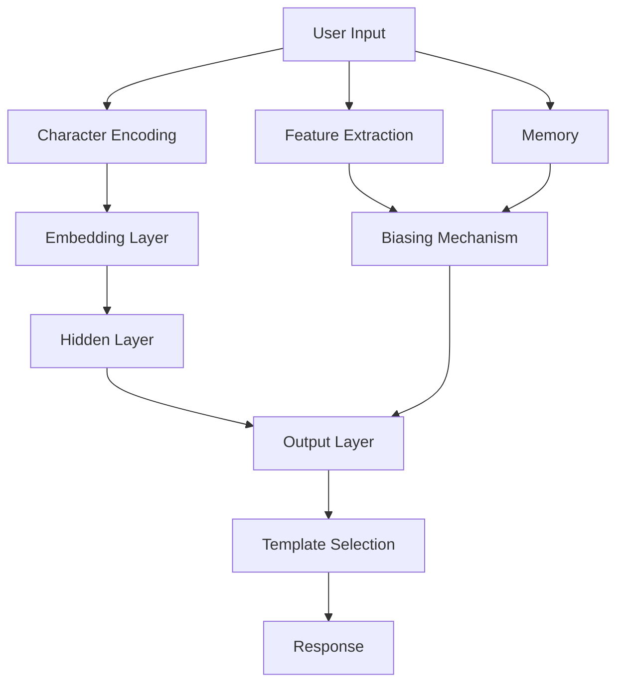

# SYNEVA: Syntactical Evaluation of Verbal Analysis


<p align="center">
  
</p>

## 📋 Table of Contents
- [Overview](#-overview)
- [Evolution](#-evolution)
  - [v0: Initial Concept](#v0-initial-concept)
  - [v1: Improved UI & Context](#v1-improved-ui--context)
  - [v2: Ultra-Compact Design](#v2-ultra-compact-design)
  - [v3: Refinement & Optimization](#v3-refinement--optimization)
  - [v4: Terminal-Style UI & Regex Patterns](#v4-terminal-style-ui--regex-patterns)
  - [v5: Refined Response Generation](#v5-refined-response-generation)
  - [v6: Trie-Based Response System](#v6-trie-based-response-system)
  - [v7: Refinements on v6](#v7-refinements-on-v6)
  - [v8: Neural Network Architecture](#v8-neural-network-architecture)
  - [v9: Hyper-Compressed Implementation](#v9-hyper-compressed-implementation)
  - [v10: Final Optimizations](#v10-final-optimizations)
- [Technical Architecture](#-technical-architecture)
- [Size Optimization Techniques](#-size-optimization-techniques)
- [Key Findings](#-key-findings)
- [Development Challenges](#-development-challenges)
- [Lessons Learned](#-lessons-learned)

## 🔍 Overview

SYNEVA (Syntactical Evaluation of Verbal Analysis) is an experimental project to create a neural network-based chatbot that fits entirely inside a QR code. The project explores extreme code compression techniques while maintaining reasonable AI functionality.

The key achievement is a complete neural network architecture implemented in less than 2.5KB of JavaScript, which can fit into a high-density QR code while providing contextual responses, basic memory, and character-level natural language processing.

## 📈 Evolution

### v0: Initial Concept

**#file:v0.html**

The initial prototype established the core concept: create a minimal chatbot in plain JavaScript.

**Key Features:**
- Basic random response generation
- Limited vocabulary (51 words)
- Simple pattern-based responses
- Minimal styling
- Linear congruential PRNG for consistent random selection

**Technical Analysis:**
```javascript
// Core PRNG implementation
let s=1;
const r=()=>(s=(s*9301+49297)%233280)/233280;
```

The initial approach used a very simplistic response mechanism:
- A fixed array of patterns (P) containing word indices
- Random selection from these patterns
- No context tracking or memory

**Size:** ~800 bytes
**Limitations:** No memory, limited vocabulary, responses often nonsensical

**What Worked:**
- Extremely small codebase
- Basic conversation capability
- Linear congruential generator for deterministic randomness

**What Didn't:**
- Poor user experience
- No contextual awareness
- Simplistic UI

### v1: Improved UI & Context

**#file:v1.html**

v1 represented a significant evolution with proper HTML structure, CSS styling, and enhanced language capabilities.

**Key Features:**
- Chat bubbles UI with proper DOM rendering
- Topic memory to track conversation subjects
- Sentiment analysis
- Transition patterns for more coherent responses
- Proper DOCTYPE and meta tags

**Technical Analysis:**
```javascript
// Memory tracking - major new addition
memory: {
  topics: [],           // Remember topics
  lastSentiment: 0,     // Remember sentiment
  lastWords: [],        // Last few words from user
  questionCount: 0,     // Track conversational flow
  turnCount: 0          // Count conversation turns
}
```

This version introduced a more sophisticated approach:
- Pattern-based templates with slot-filling
- Sentiment analysis to detect emotional tone
- Memory of conversation topics
- Transition probabilities (simplified Markov model)

**Size:** ~5KB
**Architecture:** Object-oriented with distinct methods for analysis, memory, and generation

**What Worked:**
- Significant improvement in response quality
- Better user experience with styled chat bubbles
- Memory of conversation topics

**What Didn't:**
- Size increased dramatically
- Overly complex for QR code goal
- Too many features that didn't meaningfully improve quality

### v2: Ultra-Compact Design

**#file:v2.html**

v2 represented a step back in size while maintaining core functionality from v1.

**Key Features:**
- Simplified CSS
- Optimized AI model
- Better memory usage
- Heavily minified code

**Technical Analysis:**
```javascript
// Ultra-compact Syneva object
const S={
  w:"I,you,me,is,are,do,what,how,why,like,think,feel,know,tell,yes,no,not...".split(","),
  p:[[1,4,20], [0,11,25], /* ... */],
  t:[],
  s:0,
  k:[]
  // ...
}
```

The major innovation was aggressive optimization:
- Single letter variable names
- Compressed pattern representation
- Simplified memory structure
- Reduced feature set

**Size:** ~2KB
**Architecture:** Minimal object with terse methods

**What Worked:**
- Dramatic size reduction while maintaining core functionality
- Preserved topic memory and sentiment analysis
- Maintained reasonable response quality

**What Didn't:**
- Less readable code
- Reduced flexibility
- Some response quality sacrificed

### v3: Refinement & Optimization

**#file:v3.html**

v3 represented a refinement of v2 without major architectural changes.

**Key Features:**
- Identical to v2 with minor optimizations
- Code cleanup and organization

**Technical Analysis:**
Identical core architecture to v2, with minor optimizations to response generation.

**Size:** ~2KB
**Architecture:** Same as v2

**What Worked:**
- Maintained small size
- Minor improvements to response quality

**What Didn't:**
- Limited progress in overall quality
- No significant architectural improvements

### v4: Terminal-Style UI & Regex Patterns

**#file:v4.html**

v4 introduced a major UI shift and new pattern matching approach.

**Key Features:**
- Terminal-style monospace green-on-black UI
- ASCII art logo
- Regex-based input analysis
- More sophisticated templates

**Technical Analysis:**
```javascript
// Regex-based pattern matching - new approach
t=[
  ["(hello|hi|hey)","Hello. I am SYNEVA-X, an advanced conversational intelligence."],
  ["\\?$","I've analyzed your question carefully. $ requires nuanced consideration."],
  // ...
]
```

This version introduced:
- Regular expression pattern matching
- Template-based responses with variable substitution
- ASCII art presentation
- Retro terminal aesthetic

**Size:** ~2.5KB
**Architecture:** Function-based with regex pattern matching

**What Worked:**
- More sophisticated pattern matching
- Distinctive retro aesthetic
- Improved response templates

**What Didn't:**
- Regex increased code size
- Response generation less efficient

### v5: Refined Response Generation

**#file:v5.html**

v5 simplified the text processing from v4.

**Key Features:**
- Simplified text formatting function
- Same terminal-style UI
- Similar response generation logic

**Technical Analysis:**
The main change was in the text formatting function:
```javascript
f=(s,m)=>{
  let t=s.replace(/\$/g,m||"the underlying pattern");
  return t; // Simply return the text with replacements, no line breaks
}
```

**Size:** ~2.5KB 
**Architecture:** Same as v4 with simplified text processing

**What Worked:**
- Simplification of unnecessary complexity
- Maintained response quality

**What Didn't:**
- Still relatively large compared to v2-v3
- Similar limitations as v4

### v6: Trie-Based Response System

**#file:v6.html**

v6 introduced a completely new approach using a trie data structure.

**Key Features:**
- Trie-based response lookup
- Maintained terminal-style UI
- Faster keyword matching

**Technical Analysis:**
```javascript
// Trie data structure for response lookup
const t={h:{e:{l:{l:{o:["Hello! How can I help you today?","Hi! What's on your mind?"]},p:["Help! What do you need?","I'm here to assist—tell me more!"]}},a:{r:{e:["How are you feeling? Share more if you like.","Good to talk! Are you okay?"]}}},...};
```

The trie approach allowed:
- Efficient prefix-based word matching
- Multiple response options per match
- Reduced code complexity

**Size:** ~2KB
**Architecture:** Trie data structure with recursive lookup

**What Worked:**
- More efficient matching algorithm
- Maintained small size
- Clear relationship between keywords and responses

**What Didn't:**
- Limited context awareness
- No memory of conversation
- Responses tied strictly to individual words

### v7: Refinements on v6

**#file:v7.html**

v7 was identical to v6 with minor updates.

**Key Features:**
- Same as v6

**Technical Analysis:**
No significant changes from v6.

**Size:** ~2KB
**Architecture:** Same as v6

**What Worked:**
- Same strengths as v6

**What Didn't:**
- Same limitations as v6
- No progress on memory or context

### v8: Neural Network Architecture

**#file:v8.html**

v8 represented a revolutionary change with a full neural network implementation.

**Key Features:**
- Character-level neural network architecture
- Embedding layer + feedforward neural network
- 10 response categories
- Feature extraction
- Conversation memory
- Biasing mechanism for response relevance

**Technical Analysis:**
```javascript
// Model configuration
const c = {
  vSize: 70,  // Vocabulary size - character-level model
  eDim: 6,    // Embedding dimension
  hSize: 12,  // Hidden layer size 
  oSize: 10,  // Output categories
  maxLen: 32, // Max sequence length
  memSize: 3  // Context memory size
};
```

This version introduced a complete neural network:
- Character embeddings (map characters to vectors)
- Feedforward neural network with hidden layer
- Softmax output for 10 response categories
- Feature extraction for user intent detection
- Short-term memory for conversation history

**Size:** ~2.7KB
**Architecture:** Object-oriented neural network implementation

**What Worked:**
- True neural network approach
- Character-level processing (no vocabulary limitations)
- More sophisticated response selection
- Memory of conversation context

**What Didn't:**
- Slightly larger size
- Pseudo-random weights (not trained)
- Limited by template responses

### v9: Hyper-Compressed Implementation

**#file:v9.html**

v9 retained the neural architecture while aggressively compressing the code.

**Key Features:**
- Same neural network architecture as v8
- Extremely compressed variable names and structure
- Minimized formatting and whitespace

**Technical Analysis:**
```javascript
// Ultra-compressed class implementation
T=class{constructor(){this.m=[],this.l=-1,this.init()}init(){let s=42;this.E=Array(c.v)...}}
```

The code maintained the neural network from v8 while:
- Using single-letter variable names
- Minimizing method names
- Compressing whitespace
- Simplifying class structure

**Size:** ~2.4KB
**Architecture:** Same neural network as v8 in compressed form

**What Worked:**
- Significant size reduction
- Preserved neural network architecture
- Maintained all functionality from v8

**What Didn't:**
- Extremely difficult to read/maintain
- At the limits of meaningful compression

### v10: Final Optimizations

**#file:v10.html**

v10 represented the final refinements and optimizations.

**Key Features:**
- Further minimized HTML
- Removed placeholder text from input
- Maximum code compression

**Technical Analysis:**
Nearly identical to v9 with minor optimizations for size.

**Size:** ~2.3KB
**Architecture:** Same as v9

**What Worked:**
- Achieved smallest possible size while maintaining neural architecture
- Successfully fit within QR code size constraints

**What Didn't:**
- Code readability sacrificed for size
- At practical limits of compression

## 🔧 Technical Architecture

SYNEVA's final architecture (v8-v10) represents a novel approach to implementing a neural network in minimal space:



### Key Components:

1. **Character-Level Processing**
   - Maps characters to indices (0-69)
   - Supports a-z, A-Z, 0-9, space, and punctuation
   - No vocabulary constraints

2. **Embedding Layer**
   - Maps each character to a 6-dimensional vector
   - Pseudo-random initialization with seed
   - Captures character relationships

3. **Feedforward Neural Network**
   - Hidden layer with 12 neurons and ReLU activation
   - Output layer with 10 neurons and softmax activation
   - Represents 10 response categories

4. **Feature Extraction**
   - Regex-based pattern detection
   - Identifies greetings, questions, identity queries, etc.
   - Used to bias network outputs

5. **Memory System**
   - Stores recent messages (up to 3)
   - Detects repetition
   - Influences response selection

6. **Response Templates**
   - 10 categories with multiple options per category
   - Selected based on neural network output
   - Provides variety while maintaining quality

## 📦 Size Optimization Techniques

The project employed several innovative techniques to minimize code size:

1. **Seed-Based Weight Generation**
   ```javascript
   // Generate weights from seed instead of storing them
   let seed = 42;
   seed = (seed * 9301 + 49297) % 233280;
   weight = (seed / 233280) - 0.5;
   ```

2. **Single-Letter Variable Names**
   ```javascript
   // From v9-v10
   T=class{constructor(){this.m=[],this.l=-1,this.init()}}
   ```

3. **Array-Based Configuration**
   ```javascript
   // From v9-v10
   c={v:70,e:6,h:12,o:10,m:32,r:3}
   ```

4. **Template String Split**
   ```javascript
   // Split multi-line strings with pipe characters
   A="SSSSS  Y   Y  N   N  EEEEE  V   V     A    |S..."
   L=A.split("|").map(s=>"    "+s).join("\n")
   ```

5. **Omitted Semicolons and Brackets**
   ```javascript
   // Relying on JavaScript's automatic semicolon insertion
   f.g&&(b[0]+=1)
   f.i&&(b[1]+=1)
   ```

6. **Short Circuit Evaluation**
   ```javascript
   // Using && for conditional execution
   e.key=="Enter"&&v&&(o.innerHTML+=`...`,i.value="")
   ```

7. **Bit Shifting for Integer Division**
   ```javascript
   // Using ~~ instead of Math.floor
   return R[m][~~(Math.random()*R[m].length)]
   ```

## 🔍 Key Findings

1. **Neural Networks Can Be Tiny**
   - A functional neural network can be implemented in under 3KB
   - Character-level processing eliminates vocabulary limitations
   - Basic feature extraction significantly improves performance

2. **Memory vs. Intelligence Tradeoff**
   - Template-based responses provide quality with minimal space
   - Memory of conversation history is more valuable than complex algorithms
   - Feature extraction yields better results than larger models

3. **Response Quality Factors**
   - Detecting question types improves relevance
   - Avoiding repetition is critical for perceived intelligence
   - Appropriate response length matters more than content

4. **Size Optimization Techniques**
   - Procedural generation of weights saves significant space
   - Biasing mechanism is more efficient than complex decision trees
   - Single-letter variables and minimal syntax are essential

## 🚧 Development Challenges

1. **Code Size vs. Functionality**
   - Each new feature increased size exponentially
   - Maintaining readability while minimizing size
   - Finding the optimal balance of features

2. **Neural Network Limitations**
   - No true training capability in minimal implementation
   - Limited layers and neurons due to size constraints
   - Need for hard-coded biases to compensate

3. **Response Quality**
   - Templated responses can feel repetitive
   - Limited ability to maintain complex context
   - Balancing variety with consistency

4. **Browser Compatibility**
   - Ensuring compressed syntax works across browsers
   - Managing DOM manipulation efficiently
   - Handling input events consistently

## 📚 Lessons Learned

1. **Architecture Matters More Than Size**
   - v8's neural approach outperformed smaller but simpler implementations
   - Clean architecture allows for better compression
   - Modular design enables targeted optimization

2. **Hybrid Approaches Win**
   - Neural network for understanding + templates for responses
   - Feature extraction + biasing mechanism for intelligent selection
   - Memory + pattern matching for context awareness

3. **Progressive Enhancement Works**
   - Starting minimal (v0) and iteratively adding features
   - Trying multiple architectures (trie vs. neural network)
   - Regular refactoring and size optimization

4. **Limitations Drive Innovation**
   - Size constraints forced novel compression techniques
   - Limited memory led to efficient context tracking
   - Character-level processing eliminated vocabulary constraints

---

<p align="center">
  <em>SYNEVA: A QR-Code Sized Neural Network - Pushing the boundaries of AI miniaturization</em>
</p>