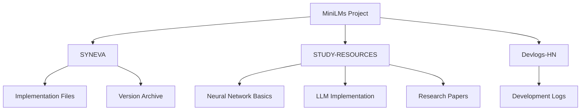
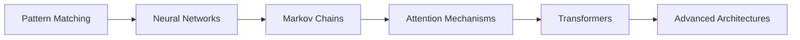

# MiniLMs: Exploring Minimal Language Model Architectures

  
  

  

## 🔍 Overview

MiniLMs is a research project focused on studying and implementing minimalist language model architectures. The project aims to understand fundamental LLM concepts by building small, efficient implementations and documenting the learning journey.

## 📁 Project Structure

## 📦 Components

### [SYNEVA](./SYNEVA/README.md)
The first practical implementation in the MiniLMs series. SYNEVA demonstrates the evolution from basic pattern matching to a minimal transformer architecture, with a focus on size optimization and architectural improvements.

### [STUDY-RESOURCES](./STUDY-RESOURCES/README.md)
A curated collection of learning materials, reference implementations, and research papers used throughout the project. Includes detailed notes and practical examples.

## 📊 Project Goals

1. **Educational**
   - Understand LLM architectures from ground up
   - Document learning journey and insights
   - Create accessible examples

2. **Technical**
   - Implement various LLM architectures
   - Explore size vs capability trade-offs
   - Study optimization techniques

3. **Research**
   - Investigate minimal viable architectures
   - Document architecture transitions
   - Share findings with community

## 🛠️ Current Focus

- Phase 1: SYNEVA Implementation & Documentation
- Neural Network Fundamentals
- Basic Transformer Architecture
- Size Optimization Techniques

## 📚 Learning Path

## 🎯 Future Directions

1. **Architecture Exploration**
   - Minimal BERT implementation
   - Lightweight GPT variants
   - Custom hybrid architectures

2. **Optimization Research**
   - Parameter sharing techniques
   - Quantization approaches
   - Architecture pruning

3. **Applications**
   - Task-specific minimalist models
   - Edge device implementations
   - Browser-based demos

## 📝 Contributing

Contributions are welcome! Please feel free to:
- Submit implementation ideas
- Share optimization techniques
- Add study resources
- Report issues or suggest improvements

## 📄 License

This project is licensed under the Apache 2.0 License - see the [LICENSE](LICENSE) file for details.

## 🔗 Related Resources

- [SYNEVA Documentation](./SYNEVA/README.md)
- [Study Resources](./STUDY-RESOURCES/README.md)
- [Development Logs](./DEVLOGS/)

---

<em>MiniLMs - Understanding Language Models Through Minimal Implementations</em>

