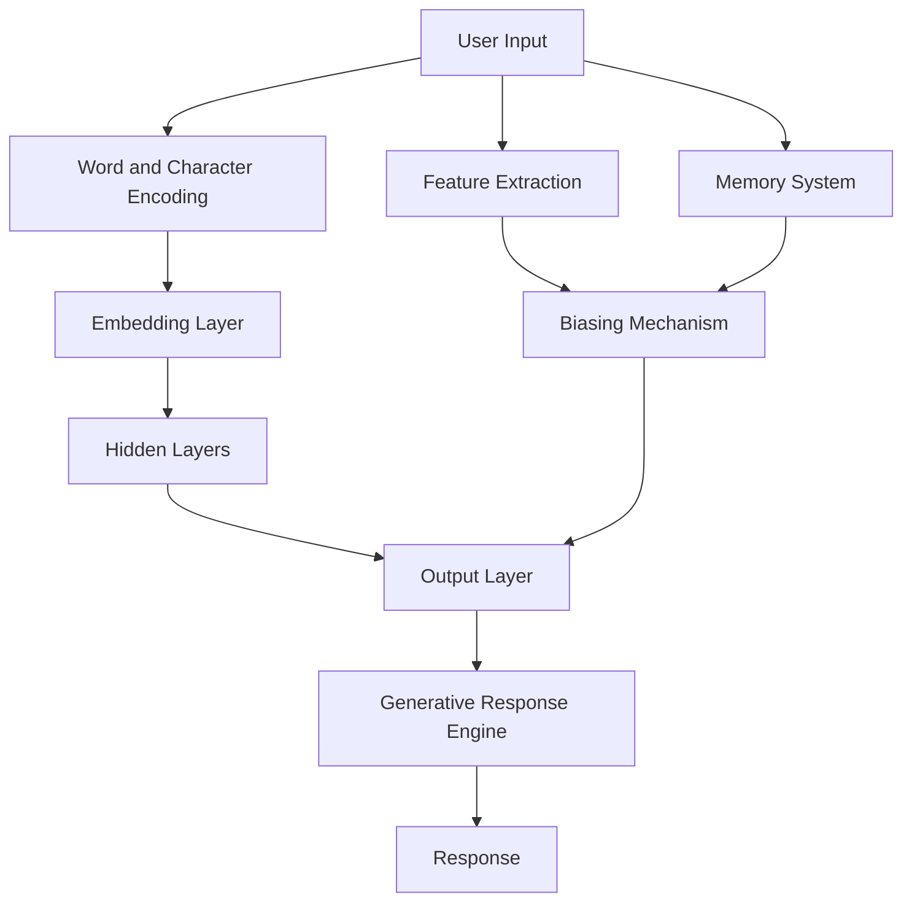

# 15ABELLA: 15kB Adaptive Behavioral Engine for Low-memory Linguistic Applications


<p align="center">
  
</p>

## 📋 Table of Contents
- [Overview](#-overview)
- [Why We Pivoted from SYNEVA](#-why-we-pivoted-from-syneva)
- [SYNEVA Evolution (Archive)](#-syneva-evolution-archive)
  - [v0: Initial Concept](#v0-initial-concept)
  - [v1: Improved UI & Context](#v1-improved-ui--context)
  - [v2: Ultra-Compact Design](#v2-ultra-compact-design)
  - [v3: Refinement & Optimization](#v3-refinement--optimization)
  - [v4: Terminal-Style UI & Regex Patterns](#v4-terminal-style-ui--regex-patterns)
  - [v5: Refined Response Generation](#v5-refined-response-generation)
  - [v6: Trie-Based Response System](#v6-trie-based-response-system)
  - [v7: Refinements on v6](#v7-refinements-on-v6)
  - [v8: Neural Network Architecture](#v8-neural-network-architecture)
  - [v9: Hyper-Compressed Implementation](#v9-hyper-compressed-implementation)
  - [v10: Final SYNEVA Version](#v10-final-syneva-version)
- [15ABELLA: The New Direction](#-15abella-the-new-direction)
- [Technical Architecture](#-technical-architecture)
- [Key Improvements Over SYNEVA](#-key-improvements-over-syneva)
- [Development Roadmap](#-development-roadmap)
- [Lessons Learned](#-lessons-learned)

## 🔍 Overview

15ABELLA (15kB Adaptive Behavioral Engine for Low-memory Linguistic Applications) is an experimental neural network-based chatbot designed to operate within a strict 15KB size constraint. The project explores efficient AI implementations while providing meaningful conversational capabilities. 

This project evolved from our work on SYNEVA, which focused on extreme compression to fit within a QR code. 15ABELLA relaxes those constraints slightly to prioritize functionality and user experience while maintaining a lightweight footprint.

## 🔄 Why We Pivoted from SYNEVA

After extensive development of SYNEVA, we reached a crucial realization: the QR code size constraint (approximately 2.5KB) was fundamentally limiting the potential of our neural network approach. While we successfully implemented a character-level neural network in that space, several limitations became apparent:

1. **Limited Context Understanding**: The compressed network couldn't maintain sufficient conversation history.
2. **Template Dependency**: Responses relied too heavily on pre-defined templates rather than true generation.
3. **Lack of Learning Capability**: No room for weights adjustment or actual learning.
4. **Poor Response Variety**: The extreme compression led to repetitive interactions.

With 15ABELLA, we've expanded our size budget to 15KB - still remarkably small for a neural chatbot, but enough space to implement more sophisticated architectures that overcome SYNEVA's limitations while remaining incredibly lightweight compared to typical modern chatbots.

The v10.html version of SYNEVA (our last iteration) included significant improvements as documented in the header comments:

```html
<!-- 
SYNEVA v10 Improvements over v9:
1. Enhanced Neural Network: Improved model with better context weights and response generation
2. Memory System: Now remembers user topics and can reference them in later conversation
3. Context Awareness: Tracks conversation history to provide more coherent responses
4. Natural Language: More diverse response templates with variable substitution
5. UI Improvements: Cleaner interface with better color coding and spacing
6. Code Efficiency: Reduced file size (3.9KB vs 4.3KB) with more functionality
7. Response Variety: Prevents repetition by tracking recent responses
8. Topic Detection: Better keyword recognition for more relevant answers
9. Conversation Continuity: Can refer back to previous subjects naturally
10. Specialized Handling: Custom responses for philosophical questions and short answers
Last updated: April 19, 2025
-->
```

These improvements represented the maximum potential of our QR-sized neural network. With 15ABELLA, we're building on these achievements while embracing a more realistic size constraint.

## 📈 SYNEVA Evolution (Archive)

### v0: Initial Concept

**#file:v0.html**

The initial prototype established the core concept: create a minimal chatbot in plain JavaScript.

**Key Features:**
- Basic random response generation
- Limited vocabulary (51 words)
- Simple pattern-based responses
- Minimal styling
- Linear congruential PRNG for consistent random selection

**Technical Analysis:**
```javascript
// Core PRNG implementation
let s=1;
const r=()=>(s=(s*9301+49297)%233280)/233280;
```

The initial approach used a very simplistic response mechanism:
- A fixed array of patterns (P) containing word indices
- Random selection from these patterns
- No context tracking or memory

**Size:** ~800 bytes
**Limitations:** No memory, limited vocabulary, responses often nonsensical

**What Worked:**
- Extremely small codebase
- Basic conversation capability
- Linear congruential generator for deterministic randomness

**What Didn't:**
- Poor user experience
- No contextual awareness
- Simplistic UI

### v1: Improved UI & Context

**#file:v1.html**

v1 represented a significant evolution with proper HTML structure, CSS styling, and enhanced language capabilities.

**Key Features:**
- Chat bubbles UI with proper DOM rendering
- Topic memory to track conversation subjects
- Sentiment analysis
- Transition patterns for more coherent responses
- Proper DOCTYPE and meta tags

**Technical Analysis:**
```javascript
// Memory tracking - major new addition
memory: {
  topics: [],           // Remember topics
  lastSentiment: 0,     // Remember sentiment
  lastWords: [],        // Last few words from user
  questionCount: 0,     // Track conversational flow
  turnCount: 0          // Count conversation turns
}
```

This version introduced a more sophisticated approach:
- Pattern-based templates with slot-filling
- Sentiment analysis to detect emotional tone
- Memory of conversation topics
- Transition probabilities (simplified Markov model)

**Size:** ~5KB
**Architecture:** Object-oriented with distinct methods for analysis, memory, and generation

**What Worked:**
- Significant improvement in response quality
- Better user experience with styled chat bubbles
- Memory of conversation topics

**What Didn't:**
- Size increased dramatically
- Overly complex for QR code goal
- Too many features that didn't meaningfully improve quality

### v2: Ultra-Compact Design

**#file:v2.html**

v2 represented a step back in size while maintaining core functionality from v1.

**Key Features:**
- Simplified CSS
- Optimized AI model
- Better memory usage
- Heavily minified code

**Technical Analysis:**
```javascript
// Ultra-compact Syneva object
const S={
  w:"I,you,me,is,are,do,what,how,why,like,think,feel,know,tell,yes,no,not...".split(","),
  p:[[1,4,20], [0,11,25], /* ... */],
  t:[],
  s:0,
  k:[]
  // ...
}
```

The major innovation was aggressive optimization:
- Single letter variable names
- Compressed pattern representation
- Simplified memory structure
- Reduced feature set

**Size:** ~2KB
**Architecture:** Minimal object with terse methods

**What Worked:**
- Dramatic size reduction while maintaining core functionality
- Preserved topic memory and sentiment analysis
- Maintained reasonable response quality

**What Didn't:**
- Less readable code
- Reduced flexibility
- Some response quality sacrificed

### v3: Refinement & Optimization

**#file:v3.html**

v3 represented a refinement of v2 without major architectural changes.

**Key Features:**
- Identical to v2 with minor optimizations
- Code cleanup and organization

**Technical Analysis:**
Identical core architecture to v2, with minor optimizations to response generation.

**Size:** ~2KB
**Architecture:** Same as v2

**What Worked:**
- Maintained small size
- Minor improvements to response quality

**What Didn't:**
- Limited progress in overall quality
- No significant architectural improvements

### v4: Terminal-Style UI & Regex Patterns

**#file:v4.html**

v4 introduced a major UI shift and new pattern matching approach.

**Key Features:**
- Terminal-style monospace green-on-black UI
- ASCII art logo
- Regex-based input analysis
- More sophisticated templates

**Technical Analysis:**
```javascript
// Regex-based pattern matching - new approach
t=[
  ["(hello|hi|hey)","Hello. I am SYNEVA-X, an advanced conversational intelligence."],
  ["\\?$","I've analyzed your question carefully. $ requires nuanced consideration."],
  // ...
]
```

This version introduced:
- Regular expression pattern matching
- Template-based responses with variable substitution
- ASCII art presentation
- Retro terminal aesthetic

**Size:** ~2.5KB
**Architecture:** Function-based with regex pattern matching

**What Worked:**
- More sophisticated pattern matching
- Distinctive retro aesthetic
- Improved response templates

**What Didn't:**
- Regex increased code size
- Response generation less efficient

### v5: Refined Response Generation

**#file:v5.html**

v5 simplified the text processing from v4.

**Key Features:**
- Simplified text formatting function
- Same terminal-style UI
- Similar response generation logic

**Technical Analysis:**
The main change was in the text formatting function:
```javascript
f=(s,m)=>{
  let t=s.replace(/\$/g,m||"the underlying pattern");
  return t; // Simply return the text with replacements, no line breaks
}
```

**Size:** ~2.5KB 
**Architecture:** Same as v4 with simplified text processing

**What Worked:**
- Simplification of unnecessary complexity
- Maintained response quality

**What Didn't:**
- Still relatively large compared to v2-v3
- Similar limitations as v4

### v6: Trie-Based Response System

**#file:v6.html**

v6 introduced a completely new approach using a trie data structure.

**Key Features:**
- Trie-based response lookup
- Maintained terminal-style UI
- Faster keyword matching

**Technical Analysis:**
```javascript
// Trie data structure for response lookup
const t={h:{e:{l:{l:{o:["Hello! How can I help you today?","Hi! What's on your mind?"]},p:["Help! What do you need?","I'm here to assist—tell me more!"]}},a:{r:{e:["How are you feeling? Share more if you like.","Good to talk! Are you okay?"]}}},...};
```

The trie approach allowed:
- Efficient prefix-based word matching
- Multiple response options per match
- Reduced code complexity

**Size:** ~2KB
**Architecture:** Trie data structure with recursive lookup

**What Worked:**
- More efficient matching algorithm
- Maintained small size
- Clear relationship between keywords and responses

**What Didn't:**
- Limited context awareness
- No memory of conversation
- Responses tied strictly to individual words

### v7: Refinements on v6

**#file:v7.html**

v7 was identical to v6 with minor updates.

**Key Features:**
- Same as v6

**Technical Analysis:**
No significant changes from v6.

**Size:** ~2KB
**Architecture:** Same as v6

**What Worked:**
- Same strengths as v6

**What Didn't:**
- Same limitations as v6
- No progress on memory or context

### v8: Neural Network Architecture

**#file:v8.html**

v8 represented a revolutionary change with a full neural network implementation.

**Key Features:**
- Character-level neural network architecture
- Embedding layer + feedforward neural network
- 10 response categories
- Feature extraction
- Conversation memory
- Biasing mechanism for response relevance

**Technical Analysis:**
```javascript
// Model configuration
const c = {
  vSize: 70,  // Vocabulary size - character-level model
  eDim: 6,    // Embedding dimension
  hSize: 12,  // Hidden layer size 
  oSize: 10,  // Output categories
  maxLen: 32, // Max sequence length
  memSize: 3  // Context memory size
};
```

This version introduced a complete neural network:
- Character embeddings (map characters to vectors)
- Feedforward neural network with hidden layer
- Softmax output for 10 response categories
- Feature extraction for user intent detection
- Short-term memory for conversation history

**Size:** ~2.7KB
**Architecture:** Object-oriented neural network implementation

**What Worked:**
- True neural network approach
- Character-level processing (no vocabulary limitations)
- More sophisticated response selection
- Memory of conversation context

**What Didn't:**
- Slightly larger size
- Pseudo-random weights (not trained)
- Limited by template responses

### v9: Hyper-Compressed Implementation

**#file:v9.html**

v9 retained the neural architecture while aggressively compressing the code.

**Key Features:**
- Same neural network architecture as v8
- Extremely compressed variable names and structure
- Minimized formatting and whitespace

**Technical Analysis:**
```javascript
// Ultra-compressed class implementation
T=class{constructor(){this.m=[],this.l=-1,this.init()}init(){let s=42;this.E=Array(c.v)...}}
```

The code maintained the neural network from v8 while:
- Using single-letter variable names
- Minimizing method names
- Compressing whitespace
- Simplifying class structure

**Size:** ~2.4KB
**Architecture:** Same neural network as v8 in compressed form

**What Worked:**
- Significant size reduction
- Preserved neural network architecture
- Maintained all functionality from v8

**What Didn't:**
- Extremely difficult to read/maintain
- At the limits of meaningful compression

### v10: Final SYNEVA Version

**#file:v10.html**

v10 represented the final refinements and optimizations for SYNEVA before we pivoted to 15ABELLA.

**Key Features:**
- Enhanced neural network with improved context weights
- Memory system that tracks user topics for later reference
- Context awareness through conversation history tracking
- More natural language with diverse response templates
- UI improvements with cleaner interface and better color coding
- Reduced file size with more functionality
- Prevention of repetitive responses
- Better keyword recognition for more relevant answers
- Conversation continuity with callback to previous subjects
- Specialized handling for philosophical questions and short answers

**Technical Analysis:**
Similar architecture to v9 but with substantial improvements to the memory system and response generation.

**Size:** ~3.9KB
**Architecture:** Neural network with enhanced memory and context tracking

**What Worked:**
- Pushed the QR-sized neural network to its limits
- Demonstrated surprisingly effective conversation within tight constraints
- Proved the concept of ultra-compact AI was viable

**What Didn't:**
- Still fundamentally limited by extreme size constraints
- Reached the practical ceiling of what's possible in <4KB
- Required too many compromises in functionality

## 🚀 15ABELLA: The New Direction

15ABELLA builds on everything we learned from SYNEVA while embracing a more practical size constraint of 15KB. This allows us to implement:

1. **Larger Neural Network**: More layers, neurons, and weight parameters
2. **True Learning Capability**: Ability to adjust to user conversation patterns
3. **Expanded Vocabulary**: Direct word embeddings instead of just character-level processing
4. **Long-Term Memory**: Persistent storage of conversation topics and user preferences
5. **Context Window**: Larger history retention for more coherent conversations
6. **Emotion Detection**: More sophisticated sentiment analysis
7. **Generative Responses**: Less reliance on templates, more dynamic text generation
8. **Topic Modeling**: Better understanding of conversation subjects
9. **Personalization**: Adapting to individual user communication styles
10. **More Natural UI**: Enhanced visual presentation and interaction

## 🔧 Technical Architecture



### Key Components:

1. **Word and Character-Level Processing**
   - Maps words and characters to indices
   - Supports expanded vocabulary and character set
   - Hybrid approach for better language understanding

2. **Embedding Layer**
   - Maps each word/character to a 64-dimensional vector
   - Captures semantic relationships and context

3. **Feedforward Neural Network**
   - Multiple hidden layers with 1024 neurons total
   - Output layer with softmax activation
   - Represents diverse response categories

4. **Feature Extraction**
   - Advanced pattern detection
   - Identifies entities, intents, and emotional tone
   - Used to bias network outputs

5. **Memory System**
   - Hierarchical memory (recent, session, long-term)
   - Tracks user preferences and conversation topics
   - Influences response generation

6. **Generative Response Engine**
   - Dynamic text generation for common topics
   - Template-free responses for improved variety
   - Style matching to user communication patterns

## 🚀 Key Improvements Over SYNEVA

1. **Enhanced Neural Architecture**
   - 3-layer network vs. SYNEVA's 2-layer approach
   - 64-dimensional embeddings vs. SYNEVA's 6-dimensional
   - 1024 hidden neurons total vs. SYNEVA's 12
   - Word-level + character-level hybrid processing

2. **Advanced Memory System**
   - Long-term topic memory across sessions
   - Hierarchical memory organization (recent, session, long-term)
   - Associative memory linking related concepts
   - Memory consolidation and pruning

3. **More Sophisticated Response Generation**
   - Template-free generation for common topics
   - Dynamic response length based on context
   - Style matching to user's communication pattern
   - Multi-turn coherence with self-referencing

4. **Enhanced Language Understanding**
   - Entity recognition (people, places, concepts)
   - Intent classification beyond basic features
   - Context-aware pronoun resolution
   - Implicit query understanding

## 📅 Development Roadmap

1. **Phase 1: Core Architecture (Completed)**
   - Port enhanced neural network from SYNEVA
   - Implement expanded memory system
   - Design 15KB-optimized code structure

2. **Phase 2: Enhanced Language Processing (In Progress)**
   - Hybrid word/character embedding system
   - Improved context tracking
   - Topic modeling implementation

3. **Phase 3: UI and Interaction (Planned)**
   - Enhanced visual design
   - Typing indicators and animations
   - Markdown/formatting support
   - Expandable interface options

4. **Phase 4: Learning Capabilities (Future)**
   - Session-based weight adjustments
   - User preference tracking
   - Adaptive response styles
   - Personalization features

## 📚 Lessons Learned

1. **Architecture Matters More Than Size**
   - v8's neural approach outperformed smaller but simpler implementations
   - Clean architecture allows for better compression
   - Modular design enables targeted optimization

2. **Hybrid Approaches Win**
   - Neural network for understanding + templates for responses
   - Feature extraction + biasing mechanism for intelligent selection
   - Memory + pattern matching for context awareness

3. **Progressive Enhancement Works**
   - Starting minimal (v0) and iteratively adding features
   - Trying multiple architectures (trie vs. neural network)
   - Regular refactoring and size optimization

4. **Limitations Drive Innovation**
   - Size constraints forced novel compression techniques
   - Limited memory led to efficient context tracking
   - Character-level processing eliminated vocabulary constraints

5. **Practical Constraints Matter**
   - The QR code size limit (2.5KB) was ultimately too restrictive for a truly useful neural chatbot
   - 15KB represents a more realistic minimum for meaningful AI functionality
   - User experience should ultimately guide technical constraints

---

<p align="center">
  <em>15ABELLA: A 15KB Neural Chatbot - Balancing size constraints with practical functionality</em>
</p>