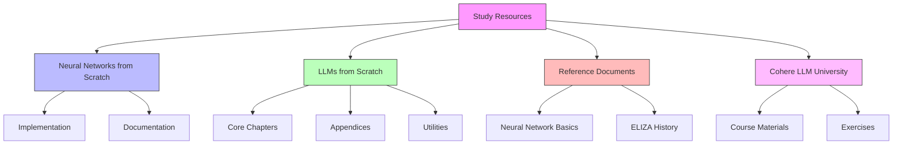
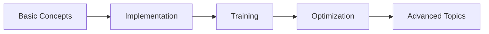
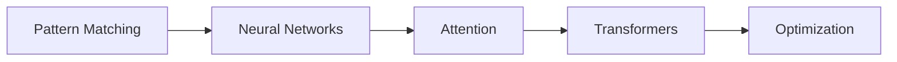

<h1 align="center">MiniLMs Study Resources</h1>

<p align="center">
   
   
</p>

<p align="center">
   

</p>

## 📚 Overview

This directory contains a curated collection of study materials, implementations, and references used throughout the MiniLMs project. The resources range from fundamental neural network concepts to advanced transformer architectures.

## 📂 Directory Structure

## 📂 Directory Structure



## 📖 Content Overview

### Neural Networks from Scratch
Implementation-focused resources for understanding neural network fundamentals.
```
Neural-Networks-from-Scratch/
├── model.py           # Core neural network implementation
├── train.py          # Training utilities
├── NN-from-Scratch.ipynb  # Interactive tutorial
└── figs/             # Diagrams and visualizations
```

### LLMs from Scratch
Comprehensive guide to building language models from fundamental principles.
```
LLMs-from-scratch/
├── ch01/ - Introduction & Fundamentals
├── ch02/ - Tokenization & Embeddings
├── ch03/ - Attention Mechanisms
├── ch04/ - Transformer Architecture
├── ch05/ - Model Training
├── ch06/ - Fine-tuning & Optimization
└── ch07/ - Advanced Topics
```

#### Special Topics
- Byte-pair encoding implementations
- Efficient attention mechanisms
- Memory optimization techniques
- Training optimizations
- User interfaces

### Reference Documents
- `But-What-is-a-Neural-Network.md`: Fundamental concepts explained
- `History-Of-ELIZA.md`: Historical context and pattern matching approaches

## 🎯 Learning Paths

### 1. Neural Network Fundamentals


### 2. LLM Architecture Evolution


## 📑 Chapter Details

### Core Chapters
1. **Chapter 1: Foundations**
   - Neural network basics
   - Activation functions
   - Backpropagation

2. **Chapter 2: Building Blocks**
   - Tokenization strategies
   - Embedding techniques
   - BytePair encoding

3. **Chapter 3: Attention**
   - Self-attention mechanism
   - Multi-head attention
   - Efficient implementations

4. **Chapter 4: Architecture**
   - Transformer blocks
   - Position encoding
   - Layer normalization

5. **Chapter 5: Training**
   - Loss functions
   - Optimization methods
   - Learning rate scheduling

6. **Chapter 6: Fine-tuning**
   - Model adaptation
   - Parameter efficiency
   - Performance optimization

7. **Chapter 7: Advanced**
   - Memory efficiency
   - Model evaluation
   - Deployment strategies

### Appendices
- **A**: Setup & Environment
- **D**: Performance Analysis
- **E**: Extended Examples

## 🛠️ Practical Components

### Implementation Examples
- Neural network from scratch
- Attention mechanisms
- Transformer blocks
- Training pipelines

### Optimization Techniques
- Memory management
- Computational efficiency
- Model compression

### Utilities
- Data preprocessing
- Training helpers
- Evaluation tools

## 📈 Progress Tracking

Track your learning progress through:
- Chapter implementations
- Exercise completion
- Project applications

## 🔗 External Resources

### Referenced Materials
- Neural network fundamentals
- Transformer architecture papers
- Optimization techniques
- Historical implementations

### Additional Reading
- Research papers
- Blog posts
- Video tutorials
- Community discussions

## 🤝 Contributing

Feel free to:
- Add new resources
- Improve documentation
- Share implementations
- Suggest optimizations

## 📌 Usage Guidelines

1. Start with fundamentals
2. Follow chapter progression
3. Complete exercises
4. Implement examples
5. Experiment with variations

---

<p align="center">
<em>Building Understanding Through Implementation</em>
</p>