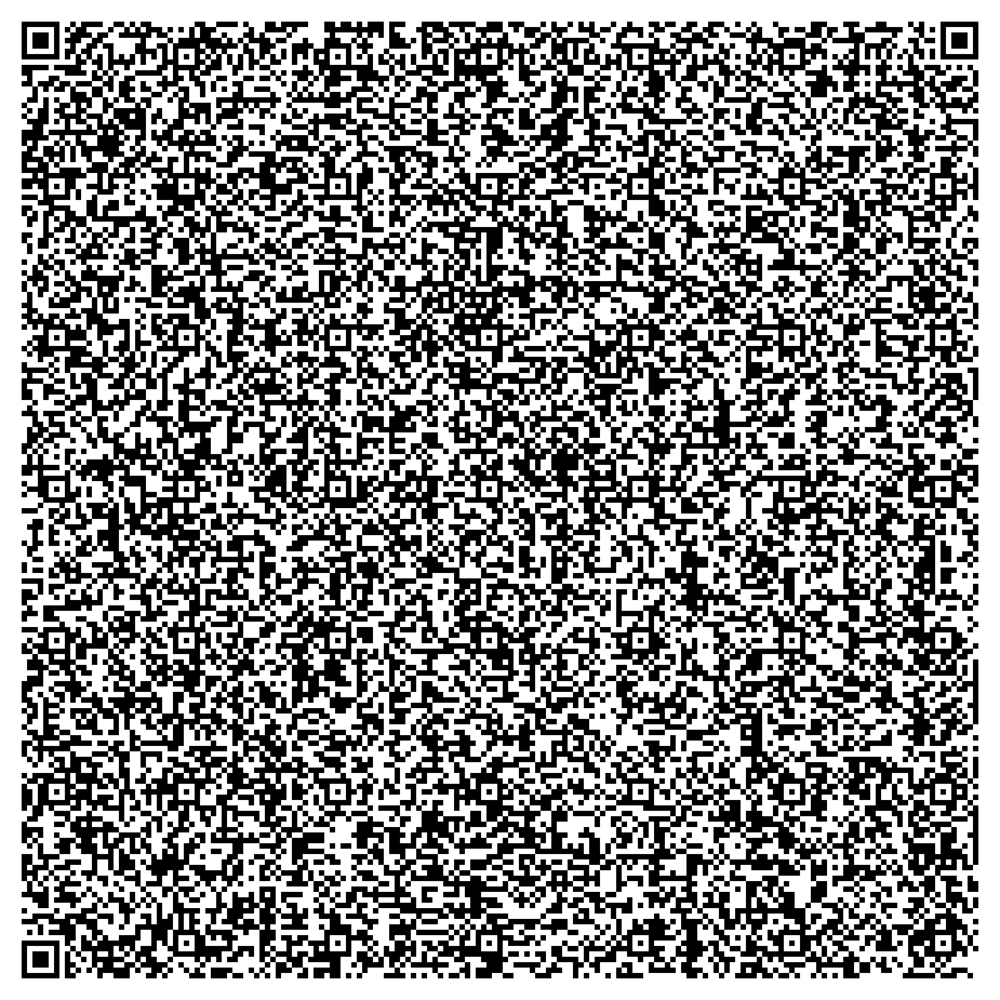
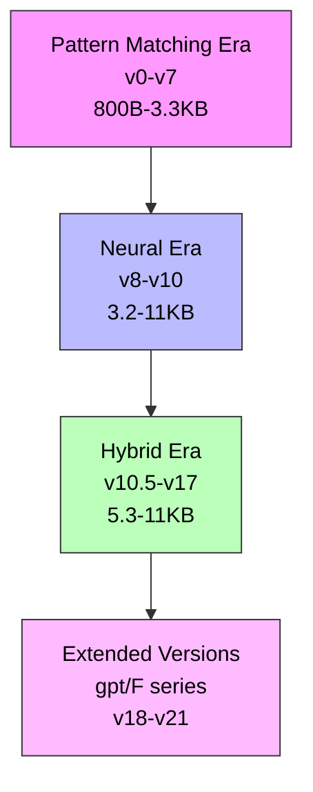
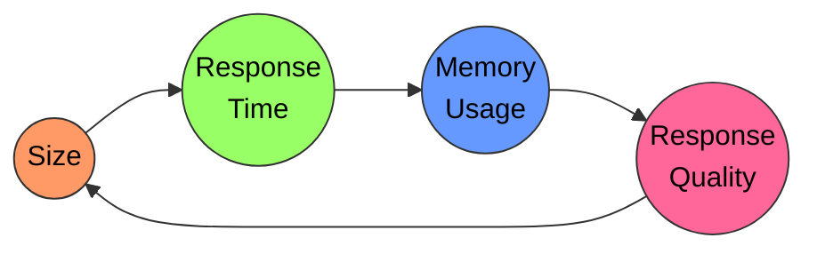

# SYNEVA: Synthetic Neural Engine for Verbal Adaptability

<p align="center">
    
    
    
</p>

<p align="center">
    

</p>

## 🔍 Overview

SYNEVA represents the first practical implementation in the MiniLMs project, demonstrating the evolution of language model architectures from basic pattern matching to a minimal transformer implementation. The project works with a strict 2.9KB size constraint (QR code limit)

<p align="center">
   
</p>
<p align="center">
   <em>Use <a href="https://scanqr.org/">this tool</a> to scan larger QR codes if your device doesn't support it</em>
</p>

## 📊 Technical Evolution



### Architecture Phases

1. **Pattern Matching Era (v0-v7)**
   - v0-v5: Simple pattern arrays and regex matching
   - v6-v7: Trie-based response lookups
   - Basic templating system
   - Terminal-style UI
   - Size: 800B - 3.3KB

2. **Neural Era (v8-v10)**
   - Character-level embeddings (6D vectors)
   - 2-layer neural network
   - Basic context tracking
   - 8-bit quantized weights
   - Size: 3.2KB - 11KB (optimized from 11KB to 3.2KB)

3. **Hybrid Era (v10.5-v17)**
   - Word-level processing (4D vectors)
   - Context-aware templating
   - Enhanced state tracking
   - Repetition penalty system
   - 8-dimensional output space
   - Size: 5.3KB - 11KB

4. **Extended Implementations (v18-v21)**
   - Sophisticated versions (gpt/F series)
   - Enhanced architecture experiments
   - Sub 3kB
## 💾 Implementation Details

### File Structure
```
SYNEVA/
├── SYNEVA.html          # Current implementation
├── qrcode.png          # QR code visualization
└── ARCHIVE/            # Version history
    ├── v0.html        # Initial pattern matching
    ├── v1-v7.html    # Pattern matching evolution 
    ├── v8-v10.html   # Neural network versions
    ├── v10.5-v14.html # Markov-Neural hybrid
    ├── v15-v17.html  # Mini-Transformer versions
    └── Sophisticated-Versions/ # Extended implementations
```

### Key Components

#### v17 Architecture Specifications
```javascript
{
  wordVectorDim: 4,
  hiddenLayerSize: 12,
  outputDim: 8,
  contextMemorySize: 5,
  vocabSize: 128,
  maxInputLength: 256
}
```

## 📈 Performance Metrics


## 🔬 Technical Highlights

### Size Optimization Techniques
1. **Early Versions**
   - Single letter variables
   - Minimal whitespace
   - Compressed patterns

2. **Neural Era**
   - Efficient matrix operations
   - Parameter sharing
   - Optimized activation functions

3. **Transformer Era** (just a couple versions)
   - Memory-efficient attention
   - Dynamic pruning
   - Efficient gradient computation

### Memory Management
- Short-term conversation memory
- Dynamic context pruning
- Efficient state management
- Browser storage optimization

## 📝 Key Learnings

1. **Architecture Evolution**
   - Gradual complexity increase
   - Trade-off management
   - Hybrid approaches effectiveness

2. **Size vs Capability**
   - Compression strategies
   - Feature prioritization
   - Performance balancing

3. **Implementation Insights**
   - Browser limitations
   - Memory optimization
   - Code organization

## 🔗 Version History

Each version in the ARCHIVE/ directory represents a significant architectural milestone or optimization breakthrough. Key transitions include:

- v0-v7: Pattern matching refinements
- v8-v10: Neural network preparation
- v10.5-v17: Hybrid architecture
- v18-v21: Extended implementations

## 📚 References

- [Neural Networks from Scratch](../STUDY-RESOURCES/Neural-Networks-from-Scratch/)
- [LLMs from Scratch](../STUDY-RESOURCES/LLMs-from-scratch/)
- [Development Logs](../Devlogs-HN/)

---

<p align="center">
<em>SYNEVA - Exploring the Evolution of Language Model Architectures</em>
</p>